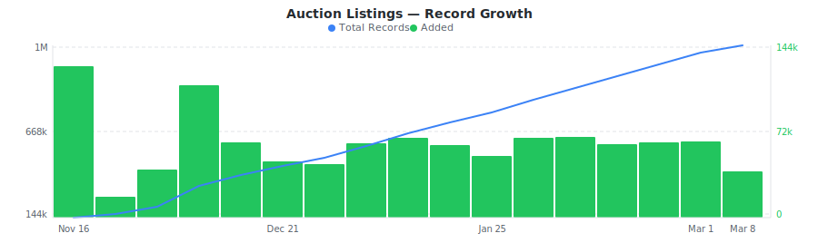

# Copart Salvage Vehicle Auction Dataset

&nbsp;&nbsp;[](https://rebrowser.net/products/datasets/copart)

Salvage vehicle auction listings with damage assessments, condition grades, title status, and yard locations from Copart's nationwide network.


This repository contains a preview sample of the [Copart dataset](https://rebrowser.net/products/datasets/copart) published by Rebrowser. If you're doing academic research, you may be eligible for free access to a much larger slice — see [Free Datasets for Research](https://rebrowser.net/free-datasets-for-research).


This dataset contains **1** entity, each in its own folder: Auction Listings (`auction-listings`). See below for a full field breakdown, sample counts, and data distributions for each.

*Found this useful? ⭐ Star this repo to help us keep publishing fresh data. Found an error? [Let us know](https://rebrowser.net/contact-us).*


---

### Auction Listings
Daily sample of Copart salvage auction lots with damage types, condition codes, title status, mileage, repair costs, and yard locations across the US.


> **1,049,686** total records from 2025-11-16 to 2026-02-22, **up to 30,000** rows in this sample (2.9% of full dataset).
> Exported as one file per day, up to 1,000 rows each, last undefined days retained.



| Field | Type | Fill Rate | Description |
| --- | --- | --- | --- |
| `_primaryKey` | `string` | 100% | Unique identifier for this record |
| `_firstSeenAt` | `datetime` | 100% | First time this record was seen |
| `_lastSeenAt` | `datetime` | 100% | Last time this record was updated |
| `lotId` | `string` | 100% | Unique Copart lot number (auction identifier) |
| `updatedAt` | `datetime` | 100% | Timestamp when Copart last updated the listing data |
| `vin` 🔒 | `string` | 100% | Vehicle Identification Number (17-character unique code) |
| `yardNumber` | `string` | 100% | Copart yard/facility number |
| `yardName` | `string` | 100% | Copart yard/facility name (e.g., "FL - MIAMI NORTH") |
| `saleDate` | `datetime` | 87% | Scheduled auction sale date |
| `saleDayOfWeek` | `string` | 87% | Day of week for the auction (e.g., TUESDAY, FRIDAY) |
| `saleTime` | `string` | 87% | Auction start time in HHMM format (e.g., "1000" = 10:00 AM) |
| `saleTimeZone` | `string` | 100% | Time zone for auction time (e.g., EST) |
| `itemNumber` | `string` | 100% | Item sequence number within the auction |
| `vehicleType` | `string` | 100% | Type code (V = Vehicle, C = Cycle/Motorcycle, K = Truck/Commercial) |
| `year` | `float` | 100% | Vehicle model year |
| `make` | `string` | 100% | Vehicle manufacturer (e.g., NISSAN, TOYOTA, MERCEDES-BENZ) |
| `modelGroup` | `string` | 100% | Vehicle model group (e.g., SENTRA, TACOMA, GLE-CLASS) |
| `modelDetail` | `string` | 100% | Detailed model name (e.g., SENTRA SV, TACOMA DOU, GLE COUPE) |
| `bodyStyle` | `string` | 16% | Vehicle body style |
| `exteriorColor` | `string` | 100% | Vehicle exterior color (e.g., WHITE, BLACK, GRAY) |
| `damageDescription` | `string` | 100% | Primary damage description (e.g., FRONT END, REAR END, MINOR DENT/SCRATCHES) |
| `secondaryDamage` | `string` | 43% | Secondary damage description (e.g., SIDE, REAR END) |
| `saleTitleState` | `string` | 100% | State where the title is held (e.g., FL) |
| `saleTitleType` | `string` | 100% | Title type code (SC = Salvage Certificate, CD = Certificate of Destruction, NR = Non-Repairable, DV = Dealer Vehicle, ST = Salvage Title, CT = Clear Title, RB = Rebuildable, AQ = Acquisition) |
| `hasKeys` | `string` | 100% | Whether keys are available (YES/NO/EXM - Exempt) |
| `lotCondCode` | `string` | 96% | Lot condition code (D = Drivable, E = Enhanced inspection, S = Stationary) |
| `mileage` | `float` | 100% | Odometer reading in miles |
| `odometerBrand` | `string` | 100% | Odometer status (A = Actual, N = Not Actual, E = Exempt) |
| `estRetailValue` 🔒 | `float` | 100% | Estimated retail value in USD |
| `repairCost` | `float` | 100% | Estimated repair cost in USD |
| `engine` | `string` | 97% | Engine description (e.g., "3.5L 6", "2.0L 4") |
| `drivetrain` | `string` | 98% | Drivetrain type (All wheel drive, Front-wheel Drive, Rear-wheel drive) |
| `transmission` | `string` | 98% | Transmission type (e.g., AUTOMATIC) |
| `fuelType` | `string` | 99% | Fuel type (e.g., GAS) |
| `cylinders` | `float` | 97% | Number of engine cylinders |
| `runsDrives` | `string` | 96% | Run/drive status (Run & Drive Verified, Vehicle Starts, DEFAULT, null) |
| `saleStatus` | `string` | 100% | Auction sale status (Pure Sale, On Minimum Bid) |
| `highBid` 🔒 | `float` | 100% | Current high bid amount in USD |
| `specialNote` | `string` | 3% | Special notes (e.g., "ODOMETER IS IN KILOMETERS") |
| `locationCity` | `string` | 100% | Vehicle storage location city |
| `locationState` | `string` | 100% | Vehicle storage location state |
| `locationZip` | `string` | 100% | Vehicle storage location ZIP code |
| `locationCountry` | `string` | 100% | Vehicle storage location country (e.g., USA) |
| `currencyCode` | `string` | 100% | Currency code for prices (e.g., USD) |
| `imageThumbnail` 🔒 | `string` | 100% | Thumbnail image URL |
| `imageUrl` 🔒 | `string` | 100% | Full-size image URL |
| `gridRow` | `string` | 100% | Yard grid/row location (e.g., "A130", "SD006", "RACK", "*OFF" for offsite) |
| `makeOfferEligible` | `bool` | 100% | Whether Make-an-Offer is available |
| `buyItNowPrice` 🔒 | `float` | 100% | Buy-It-Now price in USD (0 if not available) |
| `trim` | `string` | 75% | Vehicle trim level (e.g., SV, EX, LUXE, AMG 53 4MATIC) |
| `rentals` | `bool` | 100% | Whether vehicle was a former rental |
| `wholesale` | `bool` | 100% | Whether listing is wholesale |
| `sellerName` 🔒 | `string` | 36% | Seller name (e.g., "State Farm Insurance", "GEICO") |
| `offsiteAddress1` | `string` | 1% | Offsite pickup address line 1 |
| `offsiteState` | `string` | 1% | Offsite pickup state |
| `offsiteCity` | `string` | 1% | Offsite pickup city |
| `offsiteZip` | `string` | 1% | Offsite pickup ZIP code |
| `saleLight` | `string` | 1% | Sale light indicator |
| `autoGrade` | `float` | 2% | Auto grade rating (e.g., 3.0, 2.5) |
| `announcements` | `string` | 1% | Auction announcements and special conditions |
| `listingUrl` 🔒 | `string` | 100% | Full URL to the Copart lot listing page |


> 🔒 **Premium fields** are included in the data files but their values are replaced with `[PREMIUM]`. To access real values, [use our website](https://rebrowser.net/products/datasets/copart).


#### Field Distributions


<details>
<summary><strong>Top Vehicle Makes</strong> (<code>make</code>)</summary>


| Value | Count | Share |
| --- | --- | --- |
| TOYOTA | 135,756 | `████░░░░░░░░░░░░░░░░` 18.3% |
| FORD | 119,465 | `███░░░░░░░░░░░░░░░░░` 16.1% |
| CHEVROLET | 105,699 | `███░░░░░░░░░░░░░░░░░` 14.3% |
| HONDA | 96,294 | `███░░░░░░░░░░░░░░░░░` 13.0% |
| NISSAN | 83,233 | `██░░░░░░░░░░░░░░░░░░` 11.2% |
| HYUNDAI | 57,976 | `██░░░░░░░░░░░░░░░░░░` 7.8% |
| KIA | 45,858 | `█░░░░░░░░░░░░░░░░░░░` 6.2% |
| JEEP | 37,666 | `█░░░░░░░░░░░░░░░░░░░` 5.1% |
| DODGE | 31,507 | `█░░░░░░░░░░░░░░░░░░░` 4.3% |
| SUBARU | 27,717 | `█░░░░░░░░░░░░░░░░░░░` 3.7% |

</details>


<details>
<summary><strong>Top Damage Types</strong> (<code>damageDescription</code>)</summary>


| Value | Count | Share |
| --- | --- | --- |
| FRONT END | 565,547 | `███████████░░░░░░░░░` 56.2% |
| REAR END | 153,176 | `███░░░░░░░░░░░░░░░░░` 15.2% |
| SIDE | 134,016 | `███░░░░░░░░░░░░░░░░░` 13.3% |
| MINOR DENT/SCRATCHES | 46,462 | `█░░░░░░░░░░░░░░░░░░░` 4.6% |
| MECHANICAL | 28,355 | `█░░░░░░░░░░░░░░░░░░░` 2.8% |
| NORMAL WEAR | 21,272 | `░░░░░░░░░░░░░░░░░░░░` 2.1% |
| ALL OVER | 20,035 | `░░░░░░░░░░░░░░░░░░░░` 2.0% |
| ROLLOVER | 14,343 | `░░░░░░░░░░░░░░░░░░░░` 1.4% |
| UNDERCARRIAGE | 12,275 | `░░░░░░░░░░░░░░░░░░░░` 1.2% |
| VANDALISM | 11,521 | `░░░░░░░░░░░░░░░░░░░░` 1.1% |

</details>


<details>
<summary><strong>Title Type Distribution</strong> (<code>saleTitleType</code>)</summary>


| Value | Count | Share |
| --- | --- | --- |
| SC | 312,560 | `███████░░░░░░░░░░░░░` 33.1% |
| ST | 286,751 | `██████░░░░░░░░░░░░░░` 30.3% |
| CT | 155,453 | `███░░░░░░░░░░░░░░░░░` 16.4% |
| SV | 59,217 | `█░░░░░░░░░░░░░░░░░░░` 6.3% |
| RB | 40,559 | `█░░░░░░░░░░░░░░░░░░░` 4.3% |
| SM | 22,068 | `░░░░░░░░░░░░░░░░░░░░` 2.3% |
| BS | 20,208 | `░░░░░░░░░░░░░░░░░░░░` 2.1% |
| S1 | 18,316 | `░░░░░░░░░░░░░░░░░░░░` 1.9% |
| RS | 16,504 | `░░░░░░░░░░░░░░░░░░░░` 1.7% |
| CD | 13,766 | `░░░░░░░░░░░░░░░░░░░░` 1.5% |

</details>


<details>
<summary><strong>Listings by State</strong> (<code>locationState</code>)</summary>


| Value | Count | Share |
| --- | --- | --- |
| CA | 95,614 | `████░░░░░░░░░░░░░░░░` 18.8% |
| TX | 88,694 | `███░░░░░░░░░░░░░░░░░` 17.5% |
| FL | 64,708 | `███░░░░░░░░░░░░░░░░░` 12.7% |
| IL | 46,251 | `██░░░░░░░░░░░░░░░░░░` 9.1% |
| PA | 44,327 | `██░░░░░░░░░░░░░░░░░░` 8.7% |
| GA | 41,430 | `██░░░░░░░░░░░░░░░░░░` 8.2% |
| MI | 32,035 | `█░░░░░░░░░░░░░░░░░░░` 6.3% |
| NY | 31,965 | `█░░░░░░░░░░░░░░░░░░░` 6.3% |
| TN | 31,840 | `█░░░░░░░░░░░░░░░░░░░` 6.3% |
| AL | 30,836 | `█░░░░░░░░░░░░░░░░░░░` 6.1% |

</details>


---

## Pre-built Views on Rebrowser

Rebrowser web viewer lets you filter, sort, and export any slice of this dataset interactively. These pre-built views are ready to open:


### Auction Listings


[Listings with Bid Over $1,000](https://rebrowser.net/products/datasets/copart/auction-listings/views/listings-with-bid-over-1000) — 181,547 records

↳ `[{"field":"highBid","op":"gt","value":1000},{"sort":"highBid DESC"}]`

[Salvage Title Auctions](https://rebrowser.net/products/datasets/copart/auction-listings/views/salvage-title-auctions) — 253,963 records

↳ `[{"field":"saleTitleType","op":"is","value":"ST"},{"sort":"saleDate ASC"}]`

[Run and Drive Vehicles](https://rebrowser.net/products/datasets/copart/auction-listings/views/run-and-drive-vehicles) — 595,524 records

↳ `[{"field":"lotCondCode","op":"is","value":"D"},{"sort":"estRetailValue DESC"}]`

[Listings with Estimated Value Over $10,000](https://rebrowser.net/products/datasets/copart/auction-listings/views/listings-valued-over-10000) — 450,500 records

↳ `[{"field":"estRetailValue","op":"gt","value":10000},{"sort":"estRetailValue DESC"}]`

[Make-an-Offer Eligible Lots](https://rebrowser.net/products/datasets/copart/auction-listings/views/make-offer-eligible-lots) — 105,802 records

↳ `[{"field":"makeOfferEligible","op":"isTrue"},{"sort":"_lastSeenAt DESC"}]`


*[See all 38 views →](https://rebrowser.net/products/datasets/copart/auction-listings)*


---

## Code Examples

```python
import pandas as pd
from pathlib import Path

# ── Auction Listings ─────────────────────────────────────────────────────────
# Load the last 7 days of auction listings
files = sorted(Path('rebrowser/copart-dataset/auction-listings/data').glob('*.parquet'))[-7:]
listings = pd.concat([pd.read_parquet(f) for f in files])

# Top 10 most common makes
print(listings['make'].value_counts().head(10).to_string())

# Average mileage by damage type
damage_mileage = listings.groupby('damageDescription')['mileage'].mean().sort_values(ascending=False)
print(damage_mileage.head(10).round(0).to_string())

# Count of listings by title type and condition code
print(pd.crosstab(listings['saleTitleType'], listings['lotCondCode']).to_string())

# Run-and-drive vehicles by state, sorted by volume
drivable = listings[listings['lotCondCode'] == 'D']
print(drivable['locationState'].value_counts().head(10).to_string())

# Average repair cost by damage type
repair_by_damage = listings.groupby('damageDescription')['repairCost'].mean().sort_values(ascending=False)
print(repair_by_damage.head(10).round(2).to_string())
```

---

## Use Cases


### Salvage Value Modeling

Build predictive models for salvage vehicle pricing using damage type, condition grade, mileage, and repair cost data. Identify undervalued lots by comparing repair costs against market values.


### Parts Sourcing Pipeline

Monitor incoming auction inventory by make, model, and damage type to source high-demand parts. Filter by yard location and condition code to optimize logistics and pickup costs.


### Regional Market Analysis

Compare auction volume, vehicle mix, and damage patterns across states and Copart yards. Track seasonal trends in inventory and identify geographic arbitrage opportunities.


### Title Status Research

Analyze the distribution of salvage certificates, clean titles, and rebuildable designations across vehicle types. Study how title classification varies by state and affects auction outcomes.


---

## Full Dataset on Rebrowser


This repo is a 1,000-row preview sample. The full dataset is at [rebrowser.net/products/datasets/copart](https://rebrowser.net/products/datasets/copart)

Doing academic research? You may qualify for free access to a larger slice. See [Free Datasets for Research](https://rebrowser.net/free-datasets-for-research).

On Rebrowser you can:
- **Filter before you buy** — use the web UI to apply filters on any field and sort by any column. Preview results before purchasing. You only pay for records that match your criteria.
- **Export in your format** — CSV, JSON, JSONL, or Parquet depending on your plan.
- **Access via API** — integrate dataset queries into your pipelines and workflows.
- **Choose your freshness** — plans range from a 14-day lag to real-time data with no delay.
- **Select only the fields you need** — keep exports lean. Premium fields with richer data are available on higher plans.

[Pricing](https://rebrowser.net/pricing) starts at **$2 per 1,000 rows** with volume discounts.

---

## License & Terms

**Free for research and non-commercial use** with attribution. See [license terms](https://rebrowser.net/free-datasets-for-research#license) and [how to cite](https://rebrowser.net/free-datasets-for-research#citation).

```bibtex
@misc{rebrowser_copart,
  author       = {Rebrowser},
  title        = {Copart Salvage Vehicle Auction Dataset},
  year         = {2026},
  howpublished = {\url{https://rebrowser.net/products/datasets/copart}},
  note         = {Accessed: YYYY-MM-DD}
}
```

Commercial use requires a paid license — see [pricing](https://rebrowser.net/pricing). Use of this data is governed by the [Rebrowser Terms of Use](https://rebrowser.net/terms-of-use), which may be updated at any time independently of this repository.

---

## Disclaimer

Rebrowser is an independent data provider and is not affiliated with, endorsed by, or sponsored by Copart. Any trademarks are the property of their respective owners. This dataset is compiled from publicly available information; we do not request or collect Copart user credentials. By using this dataset, you agree to comply with Copart's Terms of Service and all applicable laws and regulations. Images, logos, descriptions, and other materials included in this dataset remain the intellectual property of their respective owners and are provided solely for informational purposes. Rebrowser makes no warranties regarding the accuracy, completeness, or legality of the data and assumes no liability for how the data is used. You are solely responsible for ensuring that your use of this dataset does not infringe on the rights of any third party.


You can also find this data on [Kaggle](https://www.kaggle.com/datasets/rebrowser/copart-dataset), [HuggingFace](https://huggingface.co/datasets/rebrowser/copart-dataset), [Zenodo](https://doi.org/10.5281/zenodo.18716356).


